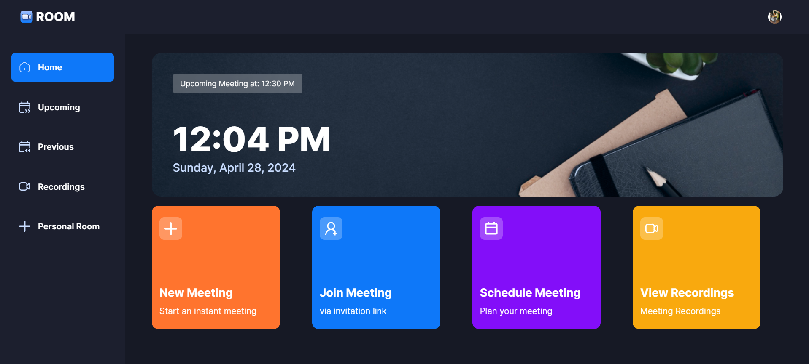
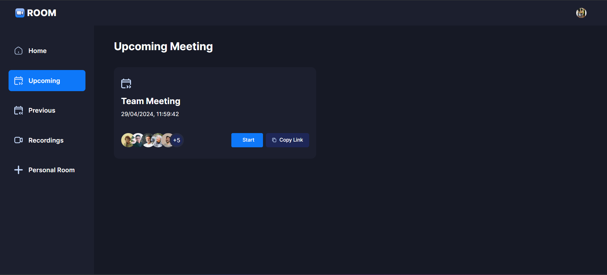
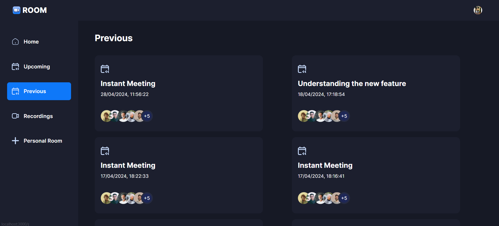
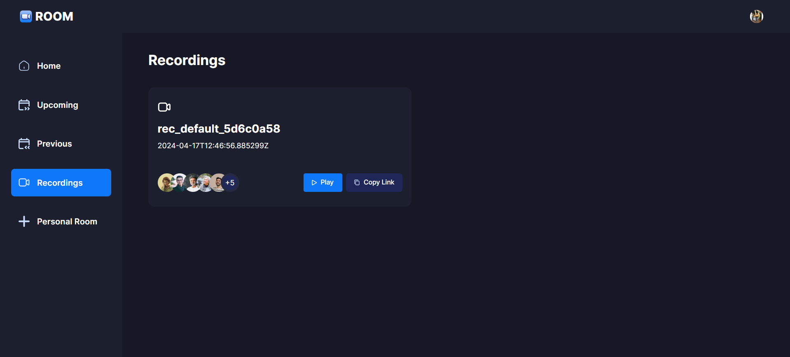
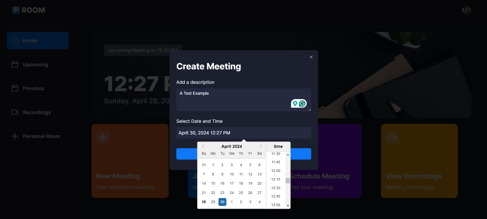
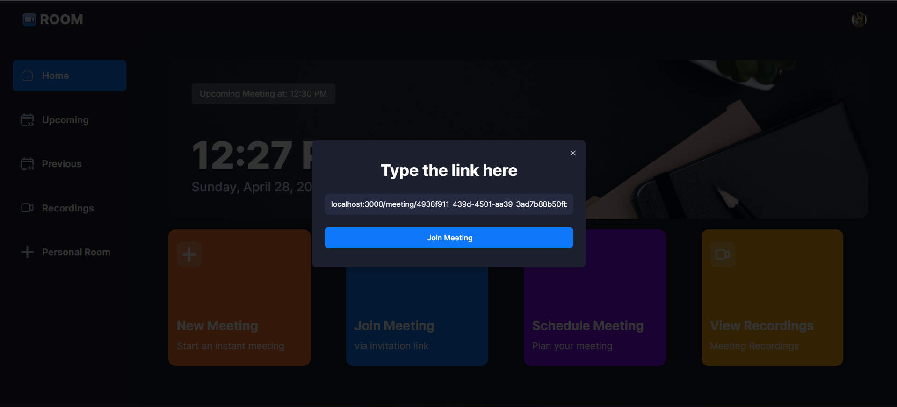
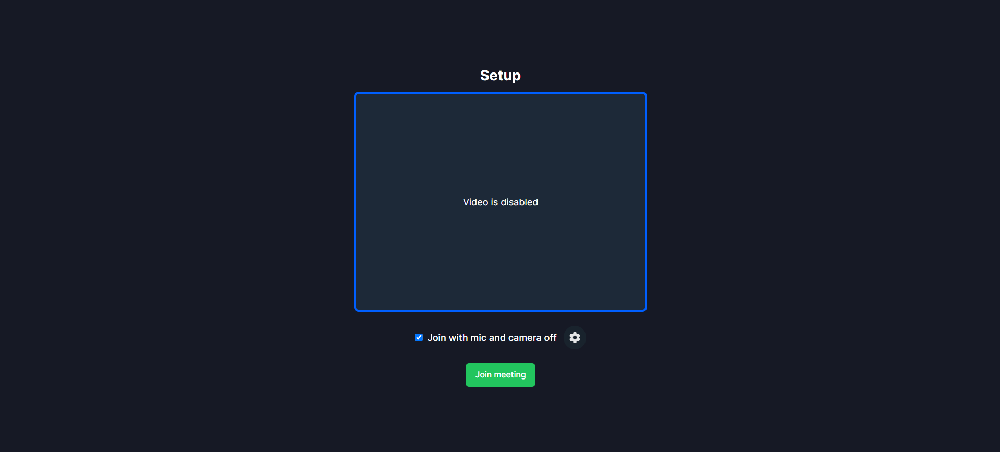
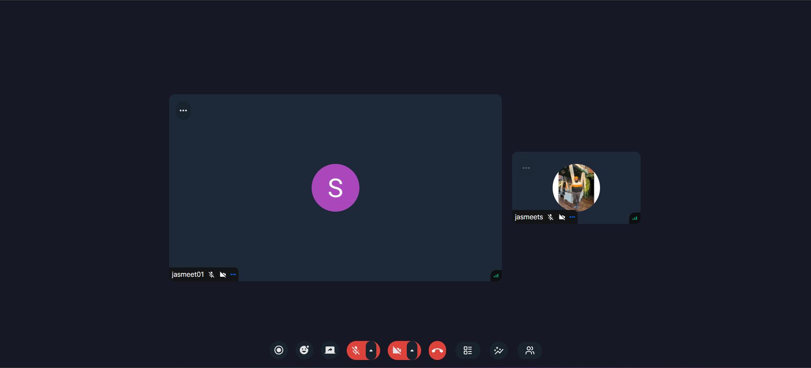

<div align="center">
  <br />
    <a>
      
    </a>
  
  <br />

  <div>
    
    
    
  </div>

  <h3 align="center">A Zoom Clone</h3>
</div>

## 📋 <a name="table">Table of Contents</a>

1. 🤖 [Introduction](#introduction)
2. ⚙️ [Tech Stack](#tech-stack)
3. 🔋 [Features](#features)
4. 🤸 [Quick Start](#quick-start)
5. 🕸️ [Assets & Code](#snippets)


## <a name="introduction">🤖 Introduction</a>

Built with the latest Next.js and TypeScript, this project replicates Zoom, a widely used video conferencing tool. It enables users to securely log in, create meetings and access various meeting functionalities such as recording, screen sharing, and managing participants.


## <a name="tech-stack">⚙️ Tech Stack</a>

- Next.js
- TypeScript
- Clerk
- getstream
- shadcn
- Tailwind CSS

## <a name="features">🔋 Features</a>


👉 **Authentication**: Implements authentication and authorization features using Clerk, allowing users to securely log in via social sign-on or traditional email and password methods, while ensuring appropriate access levels and permissions within the platform.

👉 **New Meeting**: Quickly start a new meeting, configuring camera and microphone settings before joining.

👉 **Meeting Controls**: Participants have full control over meeting aspects, including recording, emoji reactions, screen sharing, muting/unmuting, sound adjustments, grid layout, participant list view, and individual participant management (pinning, muting, unmuting, blocking, allowing video share).

👉 **Exit Meeting**: Participants can leave a meeting, or creators can end it for all attendees.

👉 **Schedule Future Meetings**: Input meeting details (date, time) to schedule future meetings, accessible on the 'Upcoming Meetings' page for sharing the link or immediate start.

👉 **Past Meetings List**: Access a list of previously held meetings, including details and metadata.

👉 **View Recorded Meetings**: Access recordings of past meetings for review or reference.

👉 **Personal Room**: Users have a personal room with a unique meeting link for instant meetings, shareable with others.

👉 **Join Meetings via Link**: Easily join meetings created by others by providing a link.

👉 **Secure Real-time Functionality**: All interactions within the platform are secure and occur in real-time, maintaining user privacy and data integrity.

👉 **Responsive Design**: Follows responsive design principles to ensure optimal user experience across devices, adapting seamlessly to different screen sizes and resolutions.

and many more, including code architecture and reusability. 

## <a name="quick-start">🤸 Quick Start</a>

Follow these steps to set up the project locally on your machine.

**Prerequisites**

Make sure you have the following installed on your machine:

- [Git](https://git-scm.com/)
- [Node.js](https://nodejs.org/en)
- [npm](https://www.npmjs.com/) (Node Package Manager)

**Cloning the Repository**

```bash
git clone https://github.com/jasmeet-singh-1801/video_conferencing_app
cd video_conferencing_app
```

**Installation**

Install the project dependencies using npm:

```bash
npm install
```

**Set Up Environment Variables**

Create a new file named `.env` in the root of your project and add the following content:

```env
NEXT_PUBLIC_CLERK_PUBLISHABLE_KEY=
CLERK_SECRET_KEY=

NEXT_PUBLIC_CLERK_SIGN_IN_URL=/sign-in
NEXT_PUBLIC_CLERK_SIGN_UP_URL=/sign-up

NEXT_PUBLIC_STREAM_API_KEY=
STREAM_SECRET_KEY=
NEXT_PUBLIC_BASE_URL=localhost:3000
```

Replace the placeholder values with your actual Clerk & getstream credentials. You can obtain these credentials by signing up on the [Clerk website](https://clerk.com/) and [getstream website](https://getstream.io/)

**Running the Project**

```bash
npm run dev
```

Open [http://localhost:3000](http://localhost:3000) in your browser to view the project.

## <a name="snippets">🕸️ Screenshot</a>
**Sign-Up and Sign-In Page**

<div style="display: flex; flex-direction: row;">
  
  
</div>

**Home Page**



**Upcoming Page**



**Previous Meeting Page**



**Recording Page**



**Personal Meeting Page**


**Extra Pages**
<div style="display: flex; flex-direction: row;">
  
  
  
  
</div>

**Use Case Diagram**


## <a name="links">🔗 Links</a>

Public assets used in the project can be found [here](https://drive.google.com/file/d/1ofTpWii_sCIdJ14uQ431xWVXpYgjtQ8Q/view?usp=sharing)


<br />
<br />


#
